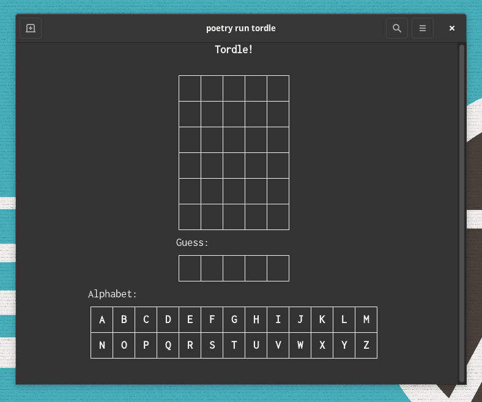

# Tordle!

Have you  fallen for the recent [Wordle](https://www.powerlanguage.co.uk/wordle/) trend? Want to play some more, and don't want to leave your terminal? Well `tordle` is for you!

Tordle does not connect to wordle. Instead, words are selected on the fly. Additionally, the game can be customized, if you're looking to expand the game.





## Installation:

```
pip install tordle
```

## Usage

```
tordle
```

## Options

- `--target-length`: Specify the size of the taget word.
- `--total-guesses`: Specify the number of tries to guess the correct word.

## Roadmap:

- Add an alphabet tracker to show which letters have been guessed.
- Add a hard mode, which requires future guesses to use past hints.
- Add an evil mode.


